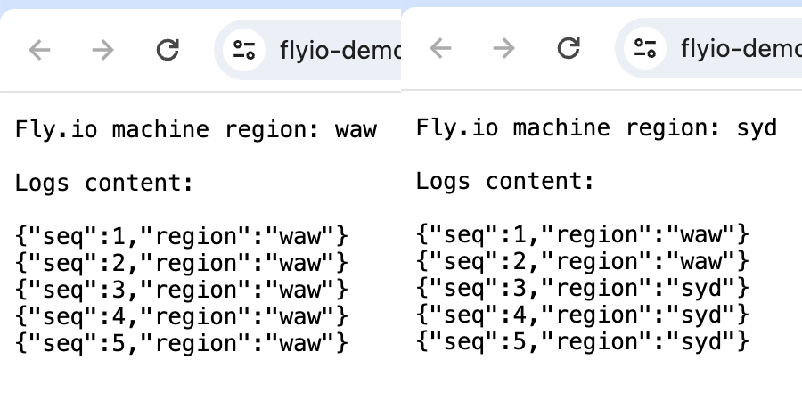

# Fly.io Demo Logger Node.js



Simple Node.js application using Fly.io Volumes writing and showing log lines.
Contains basic `fly.toml` file that defines volume and env var to use it.


Fly:

`fly launch`


Develop:

```
LOGS_PATH=`pwd` FLY_REGION=loc node server.js
```